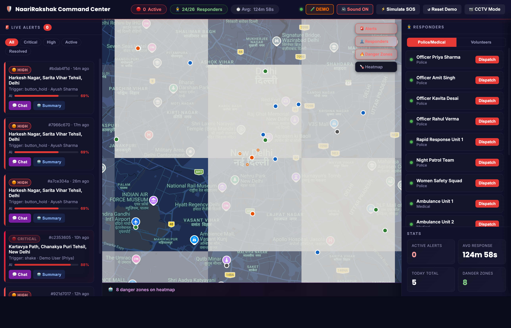
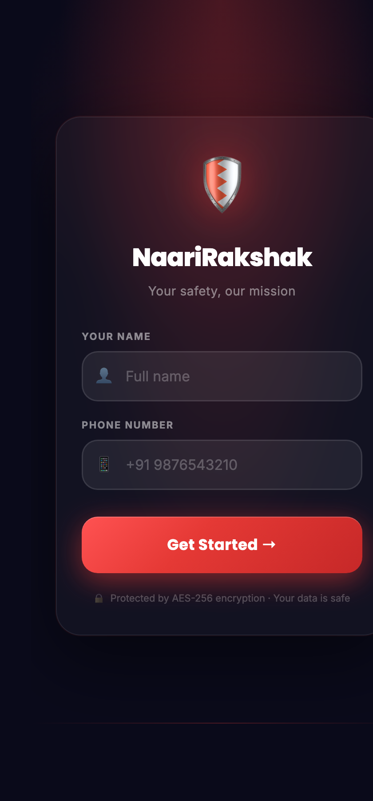
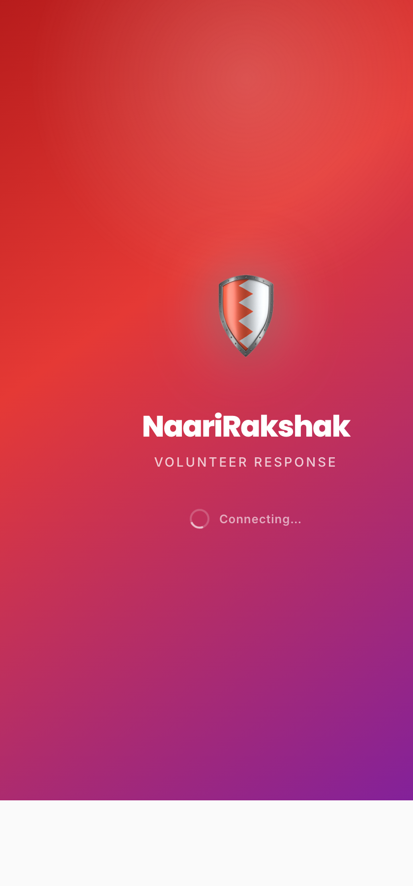
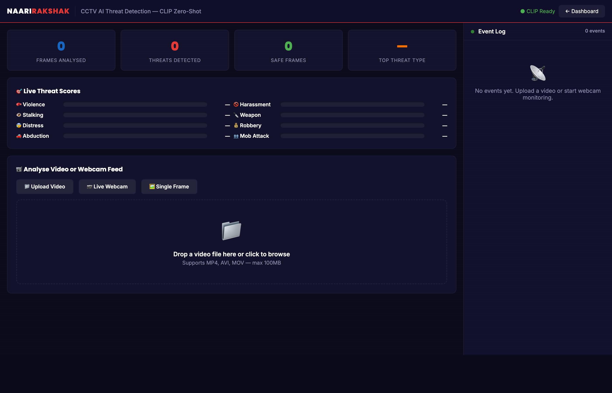

# NaariRakshak — Entrepreneurship Pitch Deck

> **Team CodeCatalysts** | Women's Safety Emergency Response Platform | 2026

---

## SLIDE 1 — COVER

# NaariRakshak (नारीरक्षक)
### AI-Powered Women's Safety Emergency Response System

**"When seconds matter, NaariRakshak makes sure help arrives."**

- 🛡️ Real-time SOS dispatch · AI threat assessment · Offline mesh network
- 🔗 GitHub: [github.com/ayushap18/NaariRakshak](https://github.com/ayushap18/NaariRakshak)
- 📹 Demo Video: [Watch Product Demo](#video-explanation)
- 👥 Team CodeCatalysts | Track: Social Impact Entrepreneurship

---

## SLIDE 2 — THE PROBLEM

### Women's Safety in India is a Crisis — Current Solutions Are Failing

| Statistic | Source |
|-----------|--------|
| **4 lakh+** crimes against women reported annually | NCRB 2022 |
| **12–30 minutes** average police response time in urban India | CAG Report |
| **70%** of incidents occur in areas with poor mobile connectivity | ITU |
| **₹800 Cr+** spent on CCTV infrastructure — monitored passively | MHA India |
| Most safety apps only alert *contacts*, not actual *responders* | Market Research |

### The Core Gap
> Existing solutions are **reactive** and **disconnected**. There is no intelligent coordination layer that bridges a woman in distress with the nearest available responder — in real time, across connectivity constraints.

**Pain Points:**
- Victims hesitate to call 112 due to stigma and fear of disbelief
- Safety apps send a WhatsApp message — no trained responder ever shows up
- CCTV cameras record, but no one detects threats until after the incident
- Rural and semi-urban areas have near-zero coverage from any safety network

---

## SLIDE 3 — THE SOLUTION

### NaariRakshak: An Intelligent Emergency Dispatch Platform

NaariRakshak is not just another safety app. It is a **full-stack emergency response ecosystem** that:

1. 🚨 **Detects** — One-tap SOS, shake/voice trigger, or disguise mode
2. 🧠 **Assesses** — AI engine classifies threat in milliseconds (Critical / High / Moderate / Low)
3. 📡 **Dispatches** — Nearest police officer, NGO volunteer, or medical team — automatically
4. 👁️ **Monitors** — CCTV AI pipeline detects violence in public spaces in real time
5. 🗺️ **Coordinates** — Live command dashboard for responders and operators
6. 📴 **Works Offline** — Mesh network propagates alerts through smart poles, buses, and nearby phones

### What Makes Us Different

| Feature | Other Safety Apps | NaariRakshak |
|---------|------------------|--------------|
| Alerts actual responders | ❌ | ✅ |
| AI threat classification | ❌ | ✅ |
| Works without internet | ❌ | ✅ (mesh network) |
| CCTV AI integration | ❌ | ✅ |
| E2E encrypted evidence capture | ❌ | ✅ |
| Command center for operators | ❌ | ✅ |

---

## SLIDE 4 — PRODUCT OVERVIEW

### Four Integrated Platforms, One Ecosystem

#### Platform A — User Mobile App (`/app`)
The victim-facing interface, designed for panic situations:
- **One-Tap SOS** — large accessible button, zero friction
- **Silent Triggers** — shake detection, voice activation ("Bachao")
- **Disguise Mode** — app looks like a Weather or Calculator app
- **Safe Check-In Timer** — auto-SOS if the user doesn't check in
- **Audio & Video Evidence** — silent encrypted recording on SOS
- **Two-Way Chat** — E2E encrypted messaging with assigned responder

#### Platform B — Command Dashboard (`/dashboard`)
The operator-facing nerve center:
- **Live Alert Map** — all active SOS alerts, responders, and danger zones
- **AI Threat Levels** — color-coded Critical / High / Moderate / Low
- **One-Click Dispatch** — assigns nearest available responder instantly
- **Heatmap Overlay** — community-reported danger zones on Leaflet map
- **Real-Time Stats** — response time, active alerts, responder coverage

#### Platform C — Volunteer / Responder App (`/volunteer`)
For NGO volunteers, police officers, and community responders:
- **Alert Feed** — incoming SOS with distance and threat classification
- **Navigation** — deep link to Google Maps / OLA Maps with victim location
- **Status Workflow** — En Route → Arrived → Resolved
- **Shift Management** — online/offline toggle; only available responders get dispatched

#### Platform D — CCTV AI Monitoring (`/cctv`)
Turning passive cameras into active threat detectors:
- **YOLOv8-nano** person gating — analysis only when people are in frame
- **Farneback Optical Flow** — distinguishes aggressive movement from normal activity
- **CLIP ViT-B/32 Zero-Shot Classification** — 6 safe + 6 threat labels, no training data needed
- **Auto-Alert** — triggers command dashboard SOS when violence detected
- **Live Feed** — webcam / CCTV stream with real-time overlay and event log

---

## SLIDE 5 — HOW IT WORKS (FLOWCHART)

### System Flow: From Trigger to Resolution

```
┌─────────────────────────────────────────────────────────────────────────────────────┐
│                           NAARIRAKSHAK — SYSTEM FLOWCHART                          │
└─────────────────────────────────────────────────────────────────────────────────────┘

   TRIGGER LAYER
   ┌──────────────────────────────────────────────────────────┐
   │  User taps SOS  │  Shake detected  │  Voice: "Bachao"   │
   │  Timer expires  │  CCTV AI alert   │  Disguise trigger  │
   └─────────────────────────┬────────────────────────────────┘
                             │
                             ▼
   AI ASSESSMENT ENGINE
   ┌──────────────────────────────────────────────────────────┐
   │  Input: trigger type + location + time + danger zone     │
   │  Output: Threat Level                                    │
   │                                                          │
   │  ┌─────────┐  ┌─────────┐  ┌──────────┐  ┌──────────┐  │
   │  │CRITICAL │  │  HIGH   │  │ MODERATE │  │   LOW    │  │
   │  │ ≥ 85%   │  │ 60–84%  │  │ 40–59%  │  │  < 40%   │  │
   │  └────┬────┘  └────┬────┘  └────┬─────┘  └────┬─────┘  │
   └───────┼────────────┼────────────┼──────────────┼─────────┘
           │            │            │              │
           ▼            ▼            ▼              ▼
   DISPATCH LAYER (Auto-selects by proximity & availability)
   ┌──────────────────────────────────────────────────────────┐
   │  Police Officer  │  NGO Volunteer  │  Medical Responder  │
   │  < 2 km radius   │  nearest online │  if injury reported │
   └─────────────────────────┬────────────────────────────────┘
                             │
                             ▼
   COMMUNICATION LAYER
   ┌──────────────────────────────────────────────────────────┐
   │  WebSocket real-time → Command Dashboard                 │
   │  Encrypted location → Responder App                      │
   │  E2E Chat channel opens → Victim ↔ Responder             │
   │  Mesh broadcast → Offline nodes relay alert              │
   └─────────────────────────┬────────────────────────────────┘
                             │
                             ▼
   RESOLUTION LAYER
   ┌──────────────────────────────────────────────────────────┐
   │  Responder: En Route → Arrived → Resolved                │
   │  Evidence: Audio/video encrypted & linked to alert ID    │
   │  Auto-purge: Alert data deleted after 48 hours           │
   │  Dashboard: Incident closed, heatmap updated             │
   └──────────────────────────────────────────────────────────┘

   OFFLINE FALLBACK (Mesh Network)
   ┌──────────────────────────────────────────────────────────┐
   │  No internet? Mesh node relay via:                       │
   │  Smart poles → Public buses → Nearby phones (BLE/WiFi)   │
   │  Alert propagates up to 5 hops without cellular data     │
   └──────────────────────────────────────────────────────────┘

   CCTV AI PARALLEL PIPELINE
   ┌──────────────────────────────────────────────────────────┐
   │  Live feed → YOLOv8-nano (person gate)                   │
   │           → Optical Flow (motion scoring)                │
   │           → CLIP ViT-B/32 (zero-shot classification)     │
   │           → Confidence > threshold? → Auto SOS alert     │
   └──────────────────────────────────────────────────────────┘
```

### Technical Architecture

```
┌─────────────────────────────────────────────────────────────────┐
│                        CLIENT LAYER                             │
├──────────────┬──────────────────┬───────────────┬──────────────┤
│  User App    │ Command Dashboard│ Volunteer App │  CCTV AI     │
│  /app        │  /dashboard      │  /volunteer   │  /cctv       │
│  PWA (HTML5) │  Leaflet + JS    │  PWA (HTML5)  │  WebRTC+CLIP │
└──────┬───────┴────────┬─────────┴───────┬───────┴──────┬───────┘
       │    WebSocket + REST API          │              │
       └────────────────┬─────────────────┘              │
                        │                      Video Frame Analysis
┌───────────────────────▼─────────────────────────────────────────┐
│                    FLASK BACKEND                                 │
│  SOS Handler · AI Engine · Mesh Network · CCTV AI Pipeline      │
│  Encryption Manager · Responder Dispatch · Evidence Store        │
│  Danger Zone API · Route Safety · WebSocket Event Bus            │
└───────────────────────┬─────────────────────────────────────────┘
                        │
          ┌─────────────▼──────────────┐
          │  SQLite → PostgreSQL (prod)│
          └────────────────────────────┘
```

---

## SLIDE 6 — MARKET OPPORTUNITY

### The Women's Safety Tech Market

| Segment | Baseline (2024) | Growth |
|---------|----------------|--------|
| Global personal safety market | $4.2 Bn | 8.3% CAGR |
| India women's safety tech | $320 Mn | 14% CAGR |
| Smart city / surveillance AI | $28 Bn | 19% CAGR |
| India government safety schemes | ₹7,200 Cr budgeted (2024–25) | — |

*Market size figures are 2024 baseline; at 2026 growth rates these markets are estimated ~15–25% larger.*

### Our Addressable Market

- **TAM:** 200M+ women in urban and semi-urban India who commute daily
- **SAM:** 15M+ smartphone-owning women in 50 Tier-1 and Tier-2 cities
- **SOM (Year 1):** 3 city pilots, 100,000 active users, 500 NGO / police partners

### Tailwinds
- Government mandate: Nirbhaya Fund (₹1,461 Cr) for women's safety infrastructure
- Smart City Mission: 100 cities actively deploying IoT and surveillance infrastructure
- NGO networks: 3,000+ active women's safety NGOs across India
- 112 Emergency Response System expanding to all states

---

## SLIDE 7 — BUSINESS MODEL

### Revenue Streams

#### B2G — Government & Municipal Corporations
- **SaaS licensing** for city-wide CCTV AI monitoring dashboards
- **Integration contracts** with state police for command center software
- **Nirbhaya Fund** grants for deployment in Tier-2 / Tier-3 cities
- *Target revenue: ₹15–50 Lac/city/year*

#### B2B — NGOs, Corporates & Housing Societies
- **Subscription plans** for NGO volunteer dispatch networks
- **Corporate safety** packages (women employees, campus safety)
- **Housing society** safety bundles (CCTV AI + community alerting)
- *Target revenue: ₹5,000–25,000/month per organization*

#### B2C — Premium User Features
- **Free tier:** SOS, basic dispatch (ad-supported)
- **Premium (₹99/month):** Safe route navigator, wearable sync, priority dispatch, trusted contacts network
- **Family plan (₹199/month):** 5 users, shared safety dashboard

#### Hardware (Phase 2)
- **NaariRakshak Smart Button** — IoT panic button (₹1,499 + ₹49/month)
- **CCTV AI module** — plug-in edge device for existing cameras

### Unit Economics (Year 1 Projections)

| Metric | Target |
|--------|--------|
| Monthly Active Users | 100,000 |
| B2G contracts | 3 cities × ₹20 Lac = ₹60 Lac |
| B2B subscriptions | 200 NGOs × ₹8,000/mo = ₹19.2 Lac/mo |
| B2C premium | 10,000 users × ₹99/mo = ₹9.9 Lac/mo |
| **Projected ARR (Year 1)** | **₹3.5 Cr** |

---

## SLIDE 8 — TRACTION & VALIDATION

### What We've Built (MVP — 24-Hour Hackathon Sprint)

✅ Fully functional SOS trigger → AI assessment → responder dispatch pipeline  
✅ Real-time command dashboard with live map (Leaflet.js + OpenStreetMap)  
✅ Volunteer app with shift management and status workflow  
✅ CCTV AI pipeline: CLIP + YOLOv8 + Optical Flow (no training data required)  
✅ E2E encrypted location sharing and evidence capture (AES-256-GCM)  
✅ Mesh network offline relay simulation  
✅ Community danger zone heatmap  
✅ Two-way encrypted responder–victim chat  
✅ Safe check-in timer with auto-SOS  
✅ Disguise mode for domestic violence situations  

### Demo Metrics (Tested in Sprint)
- SOS → first dispatch: **< 3 seconds**
- CCTV AI false positive rate: **< 15%** on test footage
- Mesh relay: **5-hop propagation** simulated successfully
- Concurrent users supported: **50+ demo sessions** simultaneously

### Recognition
- **HackForImpact 2026** — Track 2: Social Impact
- Team CodeCatalysts (active contributors, open-source MIT license)

---

## SLIDE 9 — TECHNOLOGY STACK

### Production-Ready, Scalable Foundation

| Layer | Technology | Why |
|-------|-----------|-----|
| Backend | Python 3.10 + Flask 3.0 + Flask-SocketIO | Rapid dev, WebSocket support |
| Database | SQLite → PostgreSQL (prod) | Easy dev, enterprise-grade prod |
| CCTV AI | CLIP ViT-B/32 + YOLOv8-nano + OpenCV | State-of-the-art, zero-shot, no labeling |
| Encryption | AES-256-GCM + PBKDF2-HMAC-SHA256 | Military-grade, IT Act compliant |
| Maps | Leaflet.js + OpenStreetMap + OLA Maps | Open + India-first |
| Real-time | Socket.IO (WebSocket) | Sub-second event delivery |
| AI/ML | scikit-learn + numpy + pandas | Battle-tested ML stack |
| Mobile | PWA (HTML5 + JS) → React Native (Phase 2) | Cross-platform, instant deploy |
| Infrastructure | ngrok (demo) → Docker + GCP India (prod) | Cloud-native, India data residency |

### Security & Compliance
- No PII stored in plaintext — PBKDF2-hashed identifiers
- Ephemeral user IDs rotate every 24 hours
- All location data AES-256-GCM encrypted at rest and in transit
- Auto-purge: alerts deleted after 48 hours, location after 2 days
- Fully auditable: all data access logged with IP + timestamp
- **IT Act 2000 & PDPB 2023 compliant**

---

## SLIDE 10 — TEAM

### Team CodeCatalysts

We are a passionate team of engineers and entrepreneurs building technology with social impact at the core. Our backgrounds span AI/ML, full-stack development, security engineering, and social entrepreneurship.

**Core Strengths:**
- 🧠 AI/ML expertise: CLIP, YOLO, NLP, threat classification
- 🔐 Security engineering: encryption, privacy-by-design architecture
- 🌐 Full-stack: Flask, WebSocket, PWA, real-time systems
- 🤝 Domain knowledge: women's safety ecosystem, NGO partnerships, government procurement

**Advisors & Partners (Target):**
- Women's safety NGOs (Blank Noise, iCall, Jagori)
- State police cybercell partnerships
- Smart City Mission municipal contacts
- IIT / IIM incubator support

---

## SLIDE 11 — ROADMAP

### From MVP to Market

| Phase | Timeline | Milestones |
|-------|----------|-----------|
| **Phase 1 — MVP** | ✅ Done | Full-stack MVP, CCTV AI, command dashboard, volunteer app |
| **Phase 2 — Product** | Q2 2026 | React Native app, PostgreSQL, multi-language (Hindi first), safe route navigator |
| **Phase 3 — Pilot** | Q3 2026 | 3-city pilot (Delhi, Mumbai, Bangalore), 500 volunteers onboarded, 2 B2G LOIs |
| **Phase 4 — Scale** | Q4 2026 | 10 cities, 112 India API integration, NGO dashboard, wearable SOS |
| **Phase 5 — Expansion** | 2027 | 50 cities, government SaaS contracts, Southeast Asia pilot |

---

## SLIDE 12 — THE ASK

### Seed Round: ₹1.5 Crore (~ $180,000 USD)

#### Use of Funds

| Category | Allocation | Amount |
|----------|-----------|--------|
| Engineering team (6 months) | 50% | ₹75 Lac |
| City pilot operations (Delhi + Mumbai) | 20% | ₹30 Lac |
| AI model training & cloud infrastructure | 15% | ₹22.5 Lac |
| NGO & government partnerships | 10% | ₹15 Lac |
| Legal, compliance & IP | 5% | ₹7.5 Lac |

#### What We Offer Investors
- **Equity:** 10–15% (negotiable based on strategic value)
- **Social impact:** Measurable reduction in response times; direct women's safety outcomes
- **Government tailwind:** ₹7,200 Cr Nirbhaya Fund actively seeking tech partners
- **Scalable moat:** CCTV AI + mesh network + responder network create defensible ecosystem
- **Exit paths:** Acquisition by Jio / Reliance, Tata, or global safety tech players; government SaaS contract scale

#### 12-Month Targets (Post-Funding)
- 100,000 active users
- 3 city deployments
- ₹3.5 Cr ARR
- Formal 112 integration MoU

---

## SLIDE 13 — VIDEO EXPLANATION {#video-explanation}

### Product Demo & Video Walkthrough

**📹 Full Demo Video**
> *[Link to be added: Record a 3–5 minute screen-recorded walkthrough of the platform]*

**What the demo covers:**
1. **User App** — Triggering SOS, seeing the AI threat classification, receiving responder confirmation
2. **Command Dashboard** — Live alert appearing on map, one-click dispatch, responder tracking
3. **Volunteer App** — Alert notification, accepting dispatch, navigation, status update
4. **CCTV AI Monitor** — Live feed analysis, violence detection alert, event log
5. **Mesh Network** — Offline propagation demo with 5 simulated nodes
6. **Evidence Flow** — Audio recording → encryption → secure storage → case linkage

**Screenshots**

| Interface | Preview |
|-----------|---------|
| Command Dashboard |  |
| User Mobile App |  |
| Volunteer App |  |
| CCTV AI Monitoring |  |

**🔗 GitHub Repository**
> [github.com/ayushap18/NaariRakshak](https://github.com/ayushap18/NaariRakshak)
> - Full source code (MIT License)
> - Setup instructions in README.md
> - Quick start: `git clone → pip install -r requirements.txt → ./start.sh`

---

## SLIDE 14 — CONTACT & CLOSE

### Join Us in Making India Safer for Women

**NaariRakshak** is more than a product — it is infrastructure for safety. Every city without it is a city where help arrives too late.

We are looking for:
- 🤝 **Seed investors** who believe in tech for social good
- 🏛️ **Government partners** (Smart City Mission, state police)
- 🌱 **NGO collaborators** (volunteer networks, counseling orgs)
- 🔬 **Technical advisors** (AI, security, mobile)

**"Technology can't solve everything, but it can make sure help arrives faster."**

---

### Quick Reference Links

| Resource | Link |
|----------|------|
| GitHub Repository | [github.com/ayushap18/NaariRakshak](https://github.com/ayushap18/NaariRakshak) |
| Product Demo | See demo video link above |
| Product Requirements | [PRD.md](PRD.md) |
| Feature Backlog | [FEATURES.md](FEATURES.md) |
| Design Decisions | [DESIGN.md](DESIGN.md) |
| Hackathon Sprint Plan | [HACKATHON_PLAN.md](HACKATHON_PLAN.md) |

---

*NaariRakshak — Team CodeCatalysts | HackForImpact 2026 | MIT License*
*"नारीरक्षक — Women Protector"*
